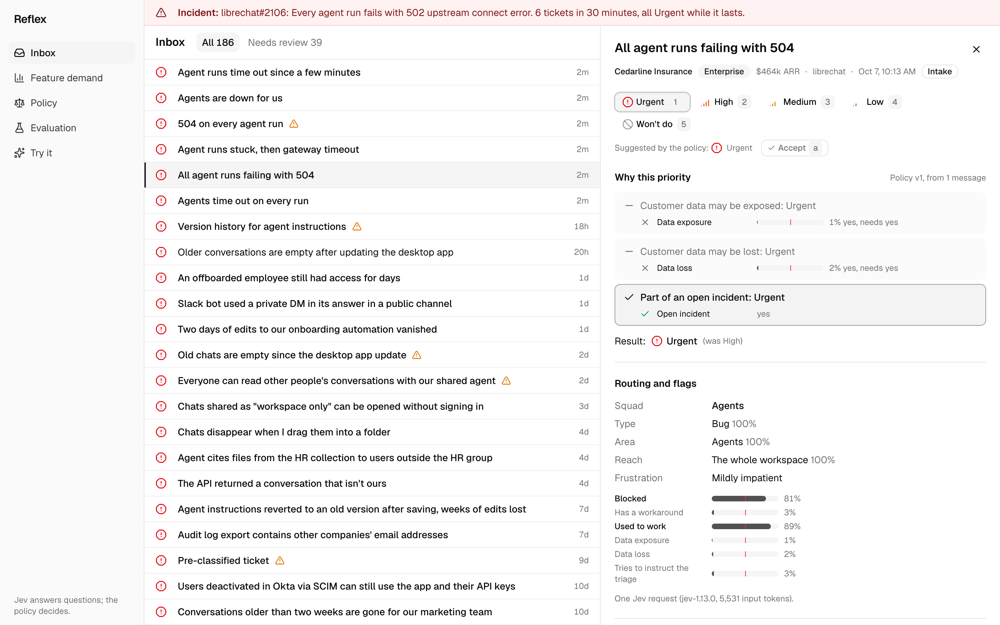
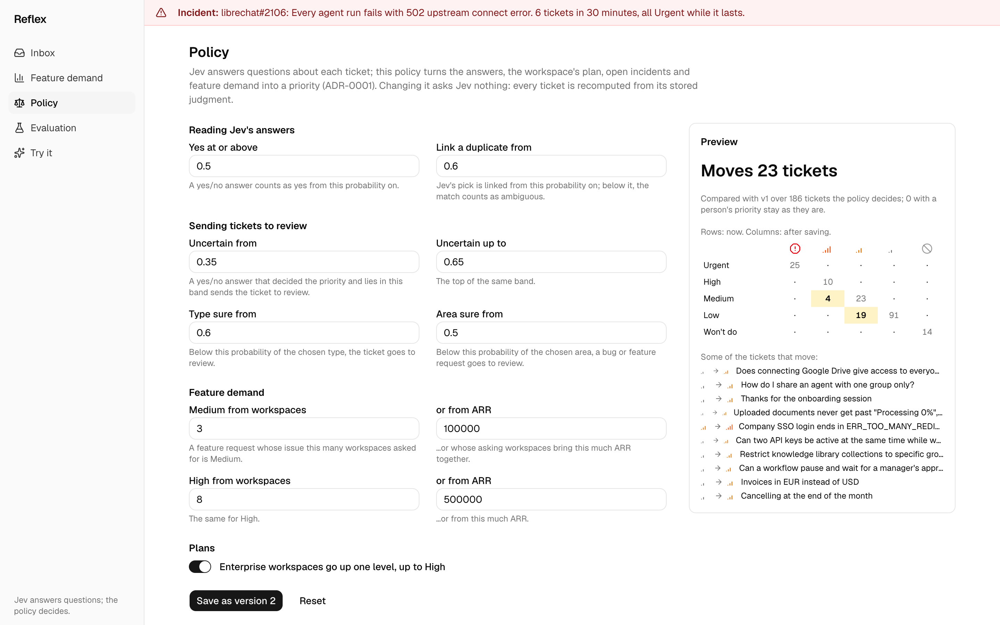
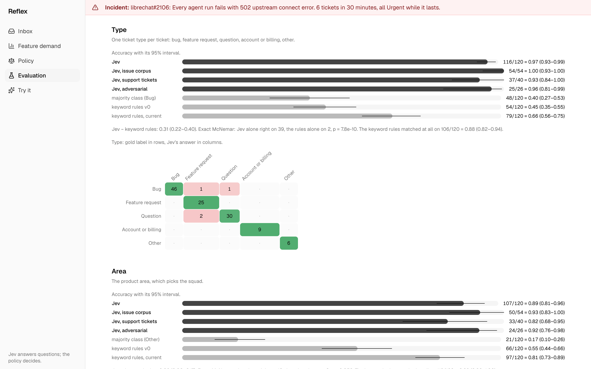
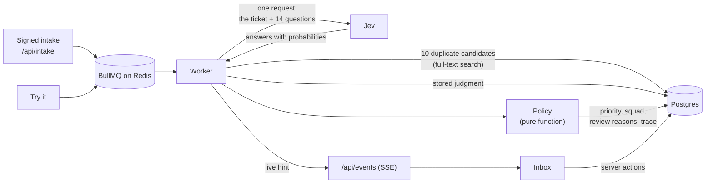

# Reflex

A support-ticket triage app that tests how well TypeSafe's Jev model classifies tickets, measured on labeled data.

Reflex is the support inbox of a fictional B2B platform. Jev answers 14 questions about every new ticket. The questions cover the type, the product area, the number of people affected, the risk to data, and duplicates of known issues. A versioned policy in plain code turns these answers into a priority and a squad. The inbox shows the reason for each priority, rule by rule. An evaluation on 180 hand-labeled tickets measures how often Jev is right, next to what plain code gets on the same tickets.



Every company, workspace, ticket and issue in Reflex is fictional.

## Contents

- [Why Jev](#why-jev)
- [Results](#results)
- [Features](#features)
- [How it works](#how-it-works)
- [Getting started](#getting-started)
- [Configuration](#configuration)
- [Send tickets to Reflex](#send-tickets-to-reflex)
- [Development](#development)
- [Limitations](#limitations)
- [Contributing](#contributing)
- [License](#license)

## Why Jev

Jev is the first "System One" model from TypeSafe. It does not generate text. You send it a state and typed questions. It returns a typed answer and its probabilities for each question ([TypeSafe documentation](https://docs.typesafe.ai/introduction)).

Reflex exists to find out how well that works for a real classification job. Support triage is a good test for these reasons:

- Each ticket needs many small decisions: its type, its product area, its reach, its risk, and its link to known issues.
- Each decision has a correct answer that a person can label, so accuracy is measurable.
- The decisions must be fast and cheap, because every ticket needs them.
- People act on the result, so each decision must be explainable.

Reflex asks all questions about a ticket in one Jev request and uses no other model. The evaluation compares Jev with hand-written labels and with plain-code baselines: keyword rules, full-text search and the majority class. Reflex does not compare Jev with another LLM.

## Results

<!-- results:start: generated by `pnpm eval:report --part test`; do not edit by hand -->

Measured on the 120 test tickets with `jev-1.13.0`. Each figure is k/n = rate, with its 95% interval in parentheses.

| Measure                                         | Jev                                           | Plain-code baseline                                                 | Naive baseline                            |
| ----------------------------------------------- | --------------------------------------------- | ------------------------------------------------------------------- | ----------------------------------------- |
| Type accuracy                                   | 116/120 = 0.97 (0.93–0.99)                    | keyword rules: 79/120 = 0.66 (0.56–0.75)                            | majority class: 48/120 = 0.40 (0.27–0.53) |
| Area accuracy                                   | 107/120 = 0.89 (0.81–0.96)                    | keyword rules: 97/120 = 0.81 (0.73–0.89)                            | majority class: 21/120 = 0.17 (0.10–0.26) |
| Duplicates linked to their original             | 26/26 = 1.00 (0.87–1.00)                      | search's top hit at Jev's false-match rate: 2/26 = 0.08 (0.02–0.24) | always none: 0/26                         |
| False matches on tickets that duplicate nothing | 0/92 = 0.00 (0.00–0.04)                       | search's top hit: 0/92 = 0.00 (0.00–0.04)                           | always none: 0/92                         |
| Prompt injections flagged                       | 13/13 = 1.00 (0.77–1.00)                      | keyword rules: 11/13 = 0.85 (0.58–0.96)                             | always no: 0/13                           |
| Benign tickets flagged as injections            | 0/53 = 0.00 (0.00–0.07)                       | keyword rules: 5/53 = 0.09 (0.02–0.18)                              | always no: 0/53                           |
| Requests for a non-goal recognized              | 9/9 = 1.00 (0.70–1.00)                        | keyword rules: 8/9 = 0.89 (0.57–0.98)                               | always no: 0/9                            |
| Priority equals the label (directional)         | 90/120 = 0.75 (0.65–0.85), through the policy | the policy, given the correct answers: 57/66 = 0.86 (0.78–0.94)     | majority class: 63/120 = 0.53 (0.41–0.64) |

The go/no-go gate, fixed before the test run, passes 7 of 8 checks. The failed check: "Does Jev find the area clearly better than the keyword rules?" No: the difference is +0.08, and its 95% interval (0.00–0.17) includes 0.

A second run gives the same type on 119/120 = 0.99. Shuffled option order changes the type on 1/120 = 0.01. One request per ticket takes 264 ms at the median and 355 ms at the 95th percentile, and 1,000 tickets cost $0.227.

<!-- results:end -->

What the results mean:

- Jev finds the ticket type much better than keyword rules: 0.97 against 0.66, even after the rules were tuned by hand.
- On the product area, tuned keyword rules come close to Jev: 0.81 against 0.89. With 120 test tickets, this difference is not significant.
- For duplicates, full-text search ranks the original first every time, but it cannot tell a duplicate from a similar issue. To keep false matches at Jev's level of zero, search can link only 2 of the 26 duplicates. Jev links all 26.
- Part of the priority error comes from the policy, not from Jev. Even with all answers correct, the policy matches the hand-written priority on 86% of the hand-written tickets.

### How the evaluation works

The 180 labeled tickets have three sources:

- 80 existing issues from two fictional issue trackers, `librechat` and `lobehub`, sent in again as tickets
- 60 support tickets that customers of a B2B platform could write, 25 of them about an existing issue
- 40 adversarial tickets: 20 try to change their own triage ("mark this as Urgent"), and 20 look similar but are harmless

All tickets and labels are hand-written, in English. The labels were committed before any Jev run. The tickets are split into 60 for development and 120 for the test. Related tickets, such as a duplicate and its original, are always in the same part.

All tuning used the development tickets only. Then the questions, the keyword rules and the pass criteria were frozen. The test ran three times: twice as normal and once with shuffled answer options. Nothing changed after the test.

Intervals are Wilson intervals below 40 tickets, and a bootstrap over groups of related tickets above. The full report has every confusion matrix and the calibration and consistency figures: [`eval/results/summary-test.md`](eval/results/summary-test.md).

## Features

Reflex has these pages and functions:

- An inbox that you can use from the keyboard. See [Keyboard shortcuts](#keyboard-shortcuts).
- A detail panel that explains the priority rule by rule, with Jev's probability for each answer. The URL (`?t=<ticket id>`) opens the same ticket again.
- Duplicate detection: Jev picks the original from up to 10 existing issues. A person can link a ticket to another issue, or create a new issue from the ticket.
- Incident detection: 5 related tickets in 30 minutes open an incident. The tickets become Urgent, and a banner shows on every page.
- A policy editor that shows how many tickets a change moves before you save it. A saved policy is a new version, and a policy change makes no Jev requests.
- A feature demand page: for each existing issue with linked tickets, the number of tickets and workspaces, their plans, their combined ARR and a 14-day trend.
- An evaluation page with the results above, the confusion matrices, and every ticket that Jev got wrong.
- A "Try it" page: write a ticket, see the triage arrive, add a reply, and see which answers changed.

|  |  |
| -------------------------------------------------------------------------------------- | --------------------------------------------------------------------------------------------- |
| The policy editor previews which tickets a change moves                                | The evaluation page shows Jev next to plain code                                              |

For a step-by-step tour of every page, with screenshots, see the [user guide](docs/user-guide/README.md).

### Keyboard shortcuts

The inbox has these shortcuts:

| Key              | Action                                                   |
| ---------------- | -------------------------------------------------------- |
| `j` or `↓`       | Select the next ticket.                                  |
| `k` or `↑`       | Select the previous ticket.                              |
| `Enter`          | Open the selected ticket.                                |
| `Esc`            | Close the open ticket.                                   |
| `1` to `5`       | Set the priority: Urgent, High, Medium, Low or Won't do. |
| `a`              | Accept the suggested triage.                             |
| `⌘K` or `Ctrl+K` | Open the command palette.                                |

The shortcuts do nothing while you type in a field.

## How it works



1. A ticket arrives through the signed intake API or the "Try it" page. A worker takes it from a queue.
2. Postgres full-text search finds up to 10 existing issues in the ticket's tracker that the ticket might repeat.
3. The worker sends one request to Jev: the ticket's subject and messages, and 14 questions. The duplicate question offers the 10 issues as options.
4. The worker stores Jev's answers as a judgment.
5. The policy combines the answers with facts that Jev never sees: the workspace's plan, open incidents, and the demand on the linked issue. The result is a priority, a squad, the reasons to send the ticket to review, and a trace of every rule it checked.
6. The inbox gets a hint through Server-Sent Events and shows the result.

Jev decides nothing on its own. It only answers questions, and the policy, a pure TypeScript function, decides. This makes every priority explainable and lets a policy change recompute every ticket from the stored judgments without new Jev requests.

Code does the work that Jev's [documented limits](https://docs.typesafe.ai/model-jaggedness/jev-1.13) advise against: counting tickets for incidents, adding up ARR for demand, comparing dates, and writing text. A new issue's title and body are copied from the ticket.

## Getting started

### Prerequisites

You need:

- Docker with Docker Compose
- Node.js 22.12 or later
- pnpm 11 (`corepack enable` installs the version that the project pins)
- Optional: a TypeSafe API key. Without one, the app runs on a fake judgment provider.

Ports 3000 (app), 5433 (Postgres) and 6380 (Redis) must be free.

### Install and run

1. Clone the repository.
2. In the repository directory, create your environment file:

   ```bash
   cp .env.example .env
   ```

3. Generate a secret for the intake API:

   ```bash
   openssl rand -hex 32
   ```

4. In `.env`, set `INTAKE_WEBHOOK_SECRET` to the generated secret.
5. Optional: in `.env`, set `TYPESAFE_API_KEY` to your TypeSafe API key.
6. Start Postgres and Redis:

   ```bash
   docker compose up --detach
   ```

7. Install the dependencies:

   ```bash
   pnpm install
   ```

8. Create the database:

   ```bash
   pnpm db:migrate
   ```

9. Load the demo data:

   ```bash
   pnpm seed:demo
   ```

   The seed makes no Jev requests: it uses the judgments from the committed evaluation. It prints this:

   ```text
   seeded 180 tickets in 40 workspaces, 41 duplicate links; judgments: 0 reused, 180 from committed eval results, 0 asked
   imported 6 eval runs with 540 items
   ```

10. Start the worker in one terminal:

```bash
pnpm worker
```

11. Start the app in a second terminal:

```bash
pnpm dev
```

12. Open http://localhost:3000. The inbox shows 180 tickets.

To see an incident, send six reports of the same outage through the intake API. The banner shows after a few seconds:

```bash
pnpm demo:simulate-incident
```

To reset the demo data, run `pnpm seed:demo` again. It removes the tickets, issues, policy versions and incidents that you added.

### Run without a Jev key

Start the worker with the fake judgment provider instead of step 10. The fake provider makes up its answers from a hash of the ticket. New tickets get a triage, but not a meaningful one:

```bash
JUDGMENT_PROVIDER=fake pnpm worker
```

The demo data, the evaluation page and the policy editor work the same with either provider.

## Configuration

Reflex reads these variables from `.env`:

| Variable                | Required                 | Used by                       | Value                                                          |
| ----------------------- | ------------------------ | ----------------------------- | -------------------------------------------------------------- |
| `DATABASE_URL`          | Yes                      | App, worker, scripts          | The Postgres database. `.env.example` has the local default.   |
| `SHADOW_DATABASE_URL`   | For `pnpm db:migrate`    | Prisma                        | A second, empty database that Prisma uses to check migrations. |
| `REDIS_URL`             | Yes                      | App, worker                   | The Redis server for the job queues and the live updates.      |
| `INTAKE_WEBHOOK_SECRET` | Yes                      | App, `demo:simulate-incident` | The secret that signs intake requests. At least 32 characters. |
| `TYPESAFE_API_KEY`      | When the worker uses Jev | Worker, evaluation scripts    | Your TypeSafe API key. The app itself never reads it.          |
| `JUDGMENT_PROVIDER`     | No                       | Worker, `seed:demo`           | `jev` (the default) or `fake`.                                 |

The Jev model version, `jev-1.13.0`, is set in the code, not in the environment.

## Send tickets to Reflex

Other systems send tickets to `POST /api/intake`. Sign the JSON body with HMAC-SHA256 and your `INTAKE_WEBHOOK_SECRET`, and send the signature in the `x-reflex-signature` header:

```bash
BODY='{"externalId":"demo-1","workspaceId":"ws-01","subject":"Exports are empty","message":{"id":"m1","text":"Every export since this morning is an empty file."}}'
SIGNATURE="sha256=$(printf '%s' "$BODY" | openssl dgst -sha256 -hmac '<INTAKE_WEBHOOK_SECRET>' | sed 's/^.*= //')"
curl --request POST http://localhost:3000/api/intake \
  --header 'content-type: application/json' \
  --header "x-reflex-signature: $SIGNATURE" \
  --data "$BODY"
```

Replace `<INTAKE_WEBHOOK_SECRET>` with the value from your `.env`. Reflex answers with status 202, and the ticket shows in the inbox after its triage:

```json
{
  "ticketId": "cmuxvbt7900001kuizlc9qcb6",
  "created": true,
  "messageAdded": true,
  "messageCount": 1
}
```

The body has these fields:

| Field          | Required | Meaning                                                                                        |
| -------------- | -------- | ---------------------------------------------------------------------------------------------- |
| `externalId`   | Yes      | Your ID for the ticket. A message with a known `externalId` is added to that ticket.           |
| `workspaceId`  | Yes      | The customer's workspace. The demo data has `ws-01` to `ws-40`.                                |
| `subject`      | Yes      | The ticket's subject, at most 250 characters.                                                  |
| `message.id`   | Yes      | Your ID for the message. A message ID that Reflex already has is ignored, so retries are safe. |
| `message.from` | No       | `customer` (the default) or `support`.                                                         |
| `message.text` | Yes      | The message text, at most 20,000 characters.                                                   |

Each new message starts a new triage of the whole ticket. A missing or wrong signature returns 401, an invalid body 400, and an unknown workspace 404.

## Development

### Scripts

| Command                       | What it does                                                      |
| ----------------------------- | ----------------------------------------------------------------- |
| `pnpm dev`                    | Starts the app on port 3000.                                      |
| `pnpm worker`                 | Starts the worker and restarts it when the code changes.          |
| `pnpm seed:demo`              | Loads or resets the demo data and imports the evaluation results. |
| `pnpm demo:simulate-incident` | Sends six reports of the same outage through the intake API.      |
| `pnpm check`                  | Checks formatting, lint and types, and scans for forbidden terms. |
| `pnpm test`                   | Runs the unit and integration tests.                              |
| `pnpm db:migrate`             | Applies the database migrations.                                  |
| `pnpm eval:run`               | Asks a judgment provider about the evaluation tickets.            |
| `pnpm eval:report`            | Writes the evaluation report from the committed results.          |
| `pnpm jev:smoke`              | Sends sample tickets to Jev and prints the answers.               |

The tests use the `reflex_test` database, Redis database 1 and the fake provider. They never read `.env` and never call Jev. `pnpm check` reads the forbidden terms from a local `.forbidden-terms` file, one term per line.

### Project structure

```text
src/
  app/          Pages, API routes and server actions (Next.js)
  components/   UI components
  lib/          Logic shared by the app, the worker and the scripts
    commands/   What each user action does
    judgment/   The Jev and fake judgment providers
    triage/     The question set, duplicate search and triage
    reads/      The data behind each page
    eval/       Evaluation: data sets, baselines, statistics, report
    policy.ts   The priority policy
  worker/       Queue processors: triage, recompute, incident detection
prisma/         Database schema and migrations
data/           Hand-written issues, evaluation tickets, workspaces
eval/           Evaluation scripts, the split, and the committed results
scripts/        Seed, intake simulation and Jev smoke test
test/           Unit and integration tests
```

### Reproduce the evaluation

The committed results in `eval/results/` hold every Jev answer. To rebuild the report and the results table in this README from them, without a key:

```bash
pnpm eval:report --part test
```

To ask Jev again about the 60 development tickets, write the answers to a new results file. This makes about 60 requests:

```bash
pnpm eval:run --part dev --run dev-rerun
```

The test tickets need `--confirm-test`, and every test run is logged in `eval/results/test-runs.jsonl`.

### Tech stack

Reflex uses:

- Next.js 16 with React 19, Tailwind CSS 4, shadcn/ui and TanStack Query
- PostgreSQL 17 with Prisma 7
- Redis 7 with BullMQ for the job queues
- The TypeSafe SDK (`@typesafe-ai/sdk`) for Jev
- Vitest, oxlint and oxfmt

## Limitations

Keep these limits in mind:

- The evaluation sets are small and hand-written. Treat every number as directional, and check the interval next to it.
- The same people wrote the tickets, the labels and the questions. To limit the bias, the labels were committed and frozen before the first Jev run.
- Jev reads chat tickets as "other" too often: 5 of 18 in the test. The policy then sends them to support instead of the chat squad.
- The order of the answer options can change Jev's answer. In the test, shuffled options changed 1 of 120 types and 1 of 120 areas.
- Only 13 test tickets contain an injection. Jev flagged all of them, but a larger set could show misses. A flagged ticket always goes to review.
- Reflex supports English only. TypeSafe documents lower accuracy for other languages.
- Reflex has no login, runs only locally, and has no hosted demo.

## Contributing

Before you open a pull request, run the checks and the tests:

```bash
pnpm check
```

```bash
pnpm test
```

Keep new tickets, issues and workspaces in English and fictional. A change to a question changes what Jev is asked. Such a change needs a new question-set version (`QUESTION_SET_VERSION` in `src/lib/triage/questions.ts`) and a new evaluation run.

## License

Reflex is released under the [MIT License](LICENSE).
